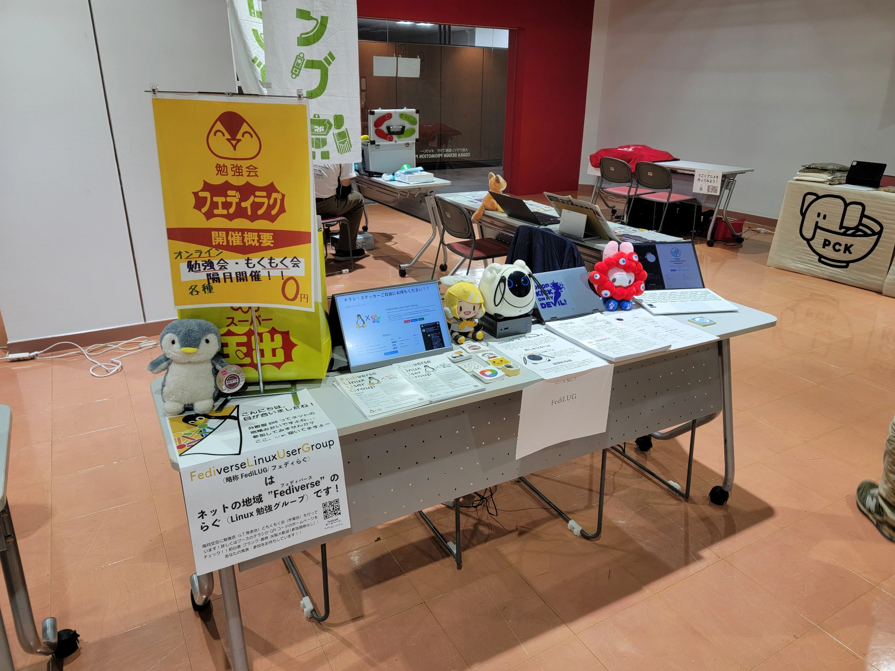
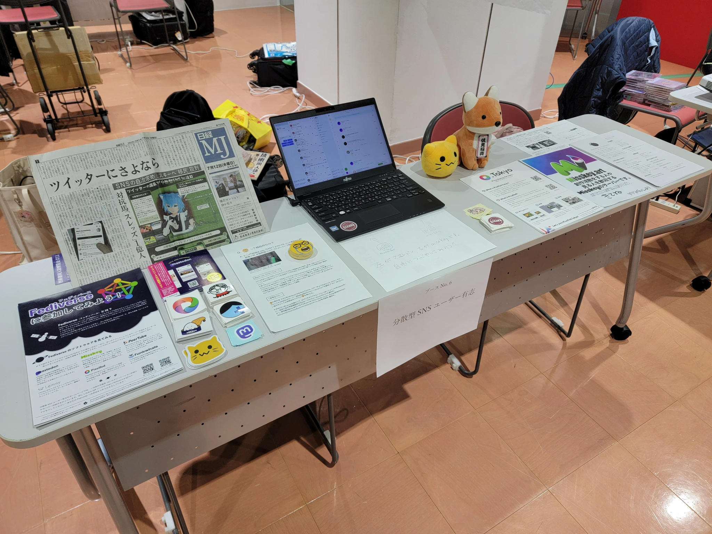

## 参加することになった経緯
5月末に株式会社紀ノ国屋のアルバイトをやめた後、しばらく大学にもバイトにも行かない生活が続いておりそろそろ金銭的にも社会的にもまずいなというところでアルバイトを探していたところ、FediLUG等でお世話になっているもちもちずきんさんにお声がけいただいて、株式会社EPOCH-NETでアルバイトをすることになりました。  
その際に、KOF行ける？と聞かれたので予定は空いてると言ったところ、KOFに連れて行ってくださることになりました。OSC京都と似たような感じです。今回は前日ではなく2週間ほど前に決まりました。  

## KOF開催概要
日時: 2024年11月8日, 9日
会場: 大阪南港ATC

https://www.k-of.jp/2024/

## ブース
分散型SNSユーザー有志とFediLUGの2つでブース番をしていました。  
### FediLUG
ポスターはスーパー玉出のエコバッグモチーフです。大阪には8日に宿泊したのですが、宿泊場所の近くにスーパー玉出があり、入店したところエコバッグを売っていたので買いました。あまりのインパクトの強さからもちもちずきんさんが作って当日印刷して飾りました。  

### 分散型SNSユーザー有志
日経MJやステッカー、パンフレットなどを配布していました。

## 東海道らぐLT大会
8日に東海道らぐの島田さんとご飯をご一緒させていただく機会があり、そこのご縁でLT大会に出てきました。内容としてはOSC 2024 Tokyo/Fallに韓国からFedify/Holloの開発者である洪 民憙(ホン・ミンヒ)さんに来ていただいたという話をしました。この件はそのうちOSC 2024 Tokyo/Fallのレポを書く機会に別途詳しい話をしようと思います。  

東海道らぐのLT大会は5分までという制限があるのですが、会場にたまたま電子レンジがあり、電子レンジのキッチンタイマーで5分を測っていました。面白かったです。

## おわりに
この場を借りて、KOFに誘ってくださったもちもちずきんさん、東京から大阪までの移動の車と宿泊場所を出していただいた株式会社EPOCH-NETの末廣さん、食事を作ってくださった末廣さんのお母さん、会場でお会いした皆様に感謝を申し上げたいと思います。大変ありがとうございました。  

次私が参加するイベントとしては、11月21日の第170回 PHP勉強会＠東京になるかと思います。  