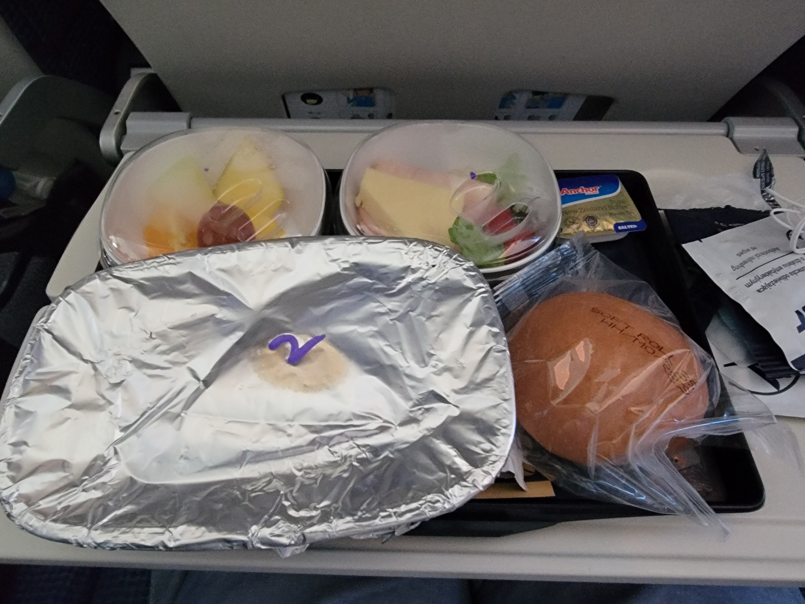

# あらすじ
4月5日にリトアニアの大学から合格通知をいただいて、9月からリトアニアにしばらく引っ越すことになりました。  
そして7月7日から18日まで、大学側のサマースクールでリトアニア語講座をやるとのことです。  
というわけで、家探しとサマースクールを受講するためにリトアニアに来ました。      

# 0日目(6/27)
飛行機。成田空港からワルシャワ・フレデリック・ショパン空港(長いので以下ワルシャワ空港)経由ヴィリニュス国際空港の経路。  
リトアニアへの飛行機は直行便がなく、ワルシャワ経由かヘルシンキ経由が一般的なようです。  
今回はワルシャワ経由で、LOTポーランド航空を利用しました。  
平時ならロシアの上を飛んで行くようですが、ご時世の都合でロシアの上空は飛べず、中東情勢も直前に悪化したので北極圏ルートでした。  
  
私はすぐ睡眠薬飲んで寝てしまったので細かいことはわかりませんが、夜の機内食ではワインを並々と注いでくれるらしいです。  

# 1日目(6/28)
飛行機で全然寝れませんでした。エコノミークラスなので足も全然伸ばせないし、緊張と同じ姿勢をし続けたせいでトイレが近かったりとで、ほとんど寝れませんでした。    
朝の機内食はこんな感じ。ポーランド時間で4時頃に出てきます。    
  
朝5:52にワルシャワ空港に到着。所要時間約13時間。  
初ヨーロッパで、初ユーラシア大陸です。  

ワルシャワ空港で乗り継ぎのために5時間ほど待機。  
空港のシステムはWindowsで動いているようです。  
  
ワルシャワ空港はそこまで大きい空港ではないので、お店が少なめでした。  
  
↑ 謎の日本語
  
↑ ハンバーガー。油すごい。  
  
↑ 保安検査後エリアの売店。車の荷台にはお酒が積まれてます。  
空港をうろちょろして時間を潰したら、ヴィリニュスへ。  

ワルシャワを現地時間で11:45に出発し、ヴィリニュスに現地時間13:50頃に到着。  
ヴィリニュス国際空港はかなり小さい空港で、正直日本の地方空港とさほど変わりません。  
機内では軽食が出ます。今回はブルーベリーのパイでした。    
  

到着後、荷物を回収して、レンタルしておいたWi-Fiに接続して、空港の外へ。  

空港の外観はこんな感じ。ソ連みがありますね。  

空港から市街地に出るには、バスかタクシー、あるいは少し歩いて鉄道を利用する必要があります。  
今回はバスを利用しました。  
バスは市街地に直接出るバスと、空港とVilnius Autobusu Stotis(バスターミナル)を往復するシャトルバスとがあります。今回はシャトルバスに乗りました。  
Vilnius Autobusu Stotisから市街地には、すぐそこのヴィリニュス中央駅付近のStotisというバス停から出るバスに乗ることで行けます。今回はホテルが駅すぐそこなので、Autobusu Stotisから歩いて行きました。  

↑ ヴィリニュス中央駅  

ホテルにチェックインしたら、旧市街に。  
中央駅と旧市街はそこまで遠くなく、歩いて十分回れます。~~バスがないともいう~~    

駅からほど近い観光スポットには、夜明けの門とハレ市場があります。  
夜明けの門は元々城壁の門だったようですが、今では門だけが残っています。  
夜明けの門に限らず、ヴィリニュスの旧市街、もっと言えばリトアニアにはあちらこちらにキリスト教、特にカトリックと正教会に関連する建築物が多くあります。  
  
↑ 夜明けの門の城壁側

↑ 夜明けの門の旧市街側  

ハレ市場は夜明けの門にほど近い場所にある現役かつヴィリニュス最古のマーケットです。奥では食品以外も売られているようです。  
  

そのまま旧市街を放浪しながらヴィリニュス大学へ。1579年に設立されたリトアニア最古の大学です。  
ヴィリニュス大学は旧市街の中心部にあり、複数の建物が繋がることで構成されています。その内側にはcourtyard(中庭)があり、ここを経由して各建物に行くことができます。　　

↑ ヴィリニュス大学の中庭の一つ  

↑ ヴィリニュス大学を構成する聖ヨハネ教会  

↑ Petras Repšysによるフレスコ画「四季("The Seasons")」。歴史あるように見えて1985年に完成された新しいもの  

そのあとはヴィリニュス大聖堂を訪れて、ホテルへ。  

↑ ヴィリニュス大聖堂  

# 2日目(6/29)
朝は昨日の帰りに買ったパンとヨーグルトを食べて、聖アンナ教会へ。  

:::note
リトアニアでの食事は基本はパンです。  
リトアニアの伝統的なパンであるキビナイや、ライ麦パンなどがあります。  
キビナイは中に肉が入ったパイのようなもので、お店によって中に何が入っているかは違います。豚肉か鶏肉が入っていることが多いです。あちらこちらで売っているのでおすすめです。  
食パンのようなものもありますが、トースト前提なので焼かないとパサパサしてて微妙です。  
リトアニア料理のレストランでは、ジャガイモ料理やシャルティバルシチェイなどを食べることができます。じゃがいもを主食とします。量が多いので気をつけましょう。  
もちろん、国際チェーンのホテルではパンケーキやクロワッサンも食べれます。  
:::

↑ 聖アンナ教会。ナポレオンが持ち帰りたいと言ったとか  

そのあとはヴィリニュス中央駅へ。  
ヴィリニュス中央駅からは、リトアニアの各都市への鉄道路線、ポーランドやラトビア、エストニアへの国際列車が出ています。  

↑ 駅の中にあるロボットがアイスを作ってくれるマシン  

↑ 乗った列車  

  
↑ 車窓からの風景。リトアニアは基本的にこんな感じの平原と森です。  

1時間ちょっとでカウナスに到着。ホテルでチェックインをしたあと体調不良でこの日はおしまいです。  

# 3日目(6/30)
朝にヴィリニュス大学カウナス学部(Vilniaus universitetas kauno fakultetas)とカウナス市庁舎、カウナス城を見に行きました。  
カウナス学部はそこまでキャンパスが広くなく、建物が少ないです。目の前に朝早くから開いているベーカリーがあり、また徒歩圏内にスーパーマーケットやコインランドリーもあり、カウナスの学生都市としての側面を感じることができます。  
:::note  
カウナスにはヴィリニュス大学カウナス学部、カウナス工科大学、ヴィータウタス・マグヌータス大公大学、ヴィリニュス芸術アカデミーカウナス学部など、リトアニア中の多くの大学(universitetas, akademija, seminarija, kolegija, aukštoji mokykla)が存在します。  
参考: [リトアニアの大学の一覧](https://ja.wikipedia.org/wiki/%E3%83%AA%E3%83%88%E3%82%A2%E3%83%8B%E3%82%A2%E3%81%AE%E5%A4%A7%E5%AD%A6%E3%81%AE%E4%B8%80%E8%A6%A7)  
:::   
  
↑ ヴィリニュス大学カウナス学部の建物の一つ  

  
↑ カウナス市庁舎。周辺を舗装工事中なため時期をあらためて訪問し直したい…  

↑ カウナス市庁舎周辺にある銅像。周りを重機に囲まれて悩んでいるように見えるのはきっと気のせいではないはず。  

 
↑ カウナス城

↑ ヴィーティスと呼ばれる馬に乗りながら右手で剣をかかげ、左手で盾を構える騎士の像。

そのあとはCAFFEINEで休憩して、リトアニア料理のお店に行っておしまい。  
CAFFEINEはリトアニアのコーヒーチェーンで、リトアニアで最も多いコーヒーチェーンです。　　

# 4日目(7/1)
この日はM. K. Čiurlionis国立美術館を見に行ったあと、聖ミカエル教会を訪れておしまい。  
M. K. Čiurlionisはリトアニアの画家・作曲家・詩人・登山家・写真家で、現代のリトアニアの文化に多大な影響を与えた人物です。  

# 5日目(7/2)
アレクソタス展望台からカウナスの旧市街を見下ろして、リトアニアでの生活用の携帯を購入したあと、Chacapuriというジョージア料理のお店でお夕飯を食べて帰投。  

# 6日目(7/3)
洗濯を回して待ち時間にペルクーナスの家を訪れたあと、一旦ホテルに帰投。その後Kauno Alusという地元の醸造所に訪れて黒ビールを買ってホテルで乾杯。  

# 7日目(7/4)
朝食を終えたらMIGRIS(移民局)から連絡があり、TRP発行の決定をいただきました。  
TRP(Temporary Residence Permit)はリトアニアに1年以上滞在するために必要な資格で、これがないと不法滞在になりますし、携帯電話や銀行もろくに契約できません。  
朝のうちに列車でカウナスからヴィリニュスに移動し、<i>占領と解放闘争博物館</i>(Museum of Occupations and Freedom Fights)を訪問したあと教会へ。しょっちゅう教会に訪れていますがキリスト教徒ではありません。日本で寺社仏閣が多いのと同じでリトアニアは教会が多いというそれだけです。  

# 所感
6年ぶりの海外渡航で、人生初ヨーロッパで、人生初非英語圏への渡航で、人生初の家探しでしたが、なんとか1週間目は無事に乗り切れました。  
観光客だと思われるのかほとんどのお店で英語で話しかけられますし(実際今はそう)、かと言って向こうの英語もそこまでレベルが高いわけではないので、英語でのコミュニケーションはそこまで苦労しませんでした。  
ちょっと面倒だったのは、私がそこそこ幼く見えるのか、未成年と間違われてホテルのチェックインで年齢を聞かれたり、お酒を買うときに必ず年齢確認を求められたりしました。日本にいるとこんなことありませんでした。  
あとレストランの料理がどこもが結構量多くて、一皿でお腹が苦しくなったり食べきれないことがあったりするのがちょっとつらいです。私が少食気味なのもあるかもしれませんが。  
ともかく、家も決まってTRPの発行の決定をもらったので一安心です。
