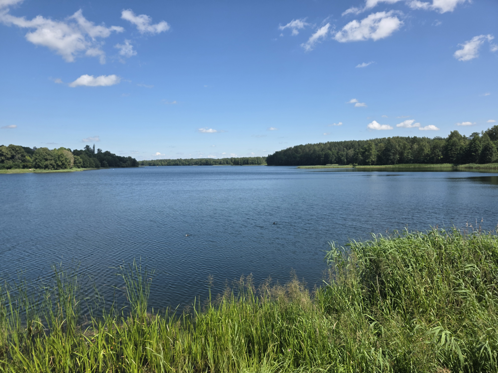
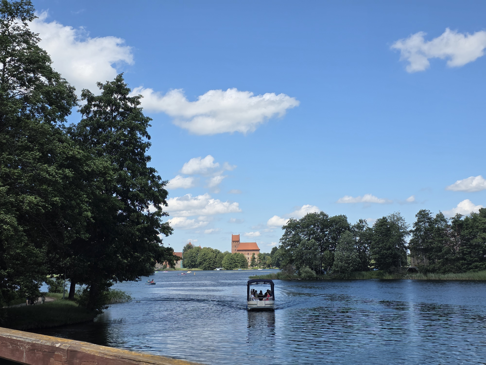

リトアニア滞在2週間目。  
# 8日目〜14日目(7/5〜7/11)
8日目に長期滞在用のゲストハウスに移動。  
そこからはサマースクールです。  
サマースクールはリトアニア語の授業とリトアニア文化の紹介の2本立てです。  
リトアニア語の授業は朝8時30分から10時と、10時30分から12時の2コマ180分が基本。文化講座は13時30分から15時までの90分。    

朝昼夜当然全ての食事を自分で調達せねばならないので、スーパーには大変お世話になってます。  
朝はライ麦パンにチーズとサラミを挟んだものとヨーグルト、昼はどこか外食、夜は日本から持ってきた食料などです。といっても持ってきた食料の量も多くないので今週のうちに日本から持ってきた食料はカロリーメイトと羊羹だけになりました。  
あと寮の部屋の冷蔵庫がたびたび止まって帰ってきたらヨーグルトやチーズが常温に戻ってるなんてのもしばしばありました。止まるな。  

この期間はほぼ毎日雨で、天気もどんよりとしてました。  

# 15日目(7/12)
久々の晴れ。  
本当ならサマースクールの一環でトラカイのツアーに行けるはずだったのですが、朝にシャワーを浴びようとして突然ドアが壊れたので、急遽修理を依頼。結局ツアーには行けませんでした。  
ドアは無事に修理されました。が、予定がパーになったので、午後は一人でトラカイに行きました。  
ヴィリニュスからトラカイまでは鉄道でおよそ30分から40分ほど。  
湖の中にある島にトラカイ城があり、湖にレンガ造の城が浮かんで見えるという美しい景色が見られます。  
また、ガルヴェ湖(トラカイの湖)自体もとても美しい湖で、風が吹くと涼しく、湖面がキラキラと輝いていてとてもきれいでした。  
言葉では表しにくいですが、実際に行ってみるとヴィリニュスやカウナスとは違う穏やかさがそこにあります。  
ちなみにトラカイ駅からトラカイ城までは約2kmほどあり、バスの本数も少ないので、荷物を軽くしてサングラスと帽子、飲料水を用意しておくのが良いでしょう。  
あと鉄道も座席数がそんなに多いわけでもないです。バスを使うことも検討しましょう。  
城の中にも入れますが、料金の割にみるものもさほどありませんでした(成人は12ユーロ)。  

↑ 駅を降りてすぐ見えるガルヴェ湖

↑ 木陰から見るガルヴェ湖

↑ 湖に浮かぶトラカイ城

# おわりに
人の話を聞くだけの授業ってどうしてあんなに眠くなるんでしょうね。永遠の謎です。  
あったかい朝ごはんが食べたい…
